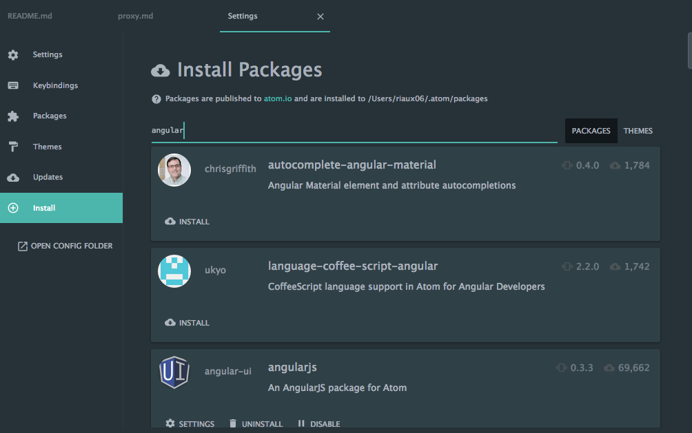
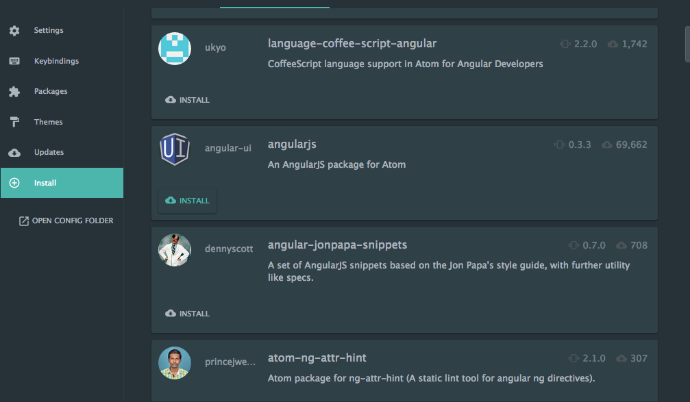
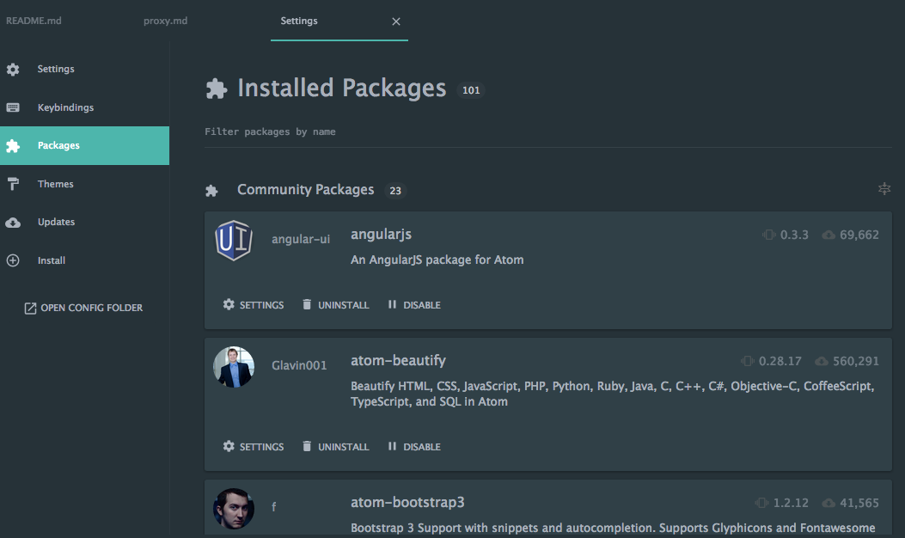

# ATOMエディタを使いこなそう勉強会

## ATOMをインストールしよう
ATOMを以下のURLよりインストールしてください。

https://atom.io/

## 覚えておくとはかどる基本的な操作
### Preferenceの起動 `Ctrl + , (cmd + ,)`
ATOMはユーザーが工夫して設定することで、もっと使いやすくすることができます。ATOMのエディタ機能に関わるところだけでなく、パッケージのインストール、インストールしたパッケージの設定、ATOMのテーマの変更など、様々な設定を行うことができます。

### コマンドパレットの実行 `Ctrl + Shift + p (cmd + Shift + p)`
ATOMの持つ機能やインストールしたパッケージなどは、コマンドパレットより操作することができます。「パッケージをインストールしたけど、ショートカットが分からない。」「どこから機能を実行すればいいか分からない。」など、困った時にはとりあえず **コマンドパレット** を起動すると、目的の機能を探し出して実行することができます。

### パッケージのインストール
ATOMはパッケージをインストールすることで、より強力なエディタにすることができます。しかし、プロキシサーバーを使用している環境では、**プロキシ設定を行わなければパッケージをインストールすることもできません。** プロキシ設定が必要な場合は[こちら](proxy.md)を参照してください。

パッケージをインストールする方法は、大きく２通りあります。GUI上で設定を行う **Preference** で設定する方法とCUI上で設定を行う **apm** で設定する方法です。

#### GUIでインストールする
Preferenceを起動 `Ctrl + , (cmd + ,)`しましょう。Settingsというタブが新たに表示されたと思います。

Settingsのメニューに存在する、Installを選択しましょう。表示されたページ上部のテキストボックスに、インストールしたいパッケージ名などを入力することで、条件にマッチするパッケージ一覧を検索することができます。


インストールしたいパッケージが存在したら、該当のパッケージのINSTALLボタンをクリックすることで、インストールすることができます。


インストールが完了したら、SettingsのメニューのPackagesを選択しましょう。インストール済みのパッケージが表示されていると思います。そこに、先ほどインストールしたパッケージが表示されていたら成功です。


Packagesを見て気づいた方もいるかと思いますが、Packagesではインストールしたパッケージの設定を行うこともできます。好みの設定にしたい場合は、パッケージのSETTINGSボタンからパッケージの設定を行ってください。

#### CUIでインストールする
CUIでインストールする場合は簡単です。パッケージ名が既に分かっている場合は、以下のコマンドを実行することでインストールすることができます。
```
apm install autocomplete-paths
```

以下のコマンドを実行すると、インストール済みのパッケージ一覧が表示されます。上手くインストールされていれば、先ほどのパッケージが表示されているとおもいます。
```
apm list
```
```
Built-in Atom packages (90)
├── about@1.1.0
~~~~~~~~~~~~省略~~~~~~~~~~~
└── wrap-guide@0.38.0

/Users/admin/.atom/packages (24)
├── atom-beautify@0.28.17
├── atom-bootstrap3@1.2.12
├── atom-jasmine@0.6.0
├── atom-material-syntax@0.2.4
├── atom-material-ui@0.7.1
├── autocomplete-paths@1.0.2 ←　インストールされている
├── color-picker@2.0.13
├── css-snippets@0.9.0
├── docblockr@0.7.3
├── docs-snippets@0.8.0
├── editorconfig@1.2.2
├── emmet@2.3.14
├── file-icons@1.6.11
├── git-control@0.4.0
├── git-history@3.2.0
├── git-plus@5.5.4
├── highlight-column@0.5.0
├── highlight-line@0.11.0
├── japanese-wrap@0.2.7
├── javascript-snippets@1.0.0
├── linter@1.10.0
├── linter-jscs@3.2.0
├── minimap@4.16.0
└── nodejs-snippets@1.0.3
```

他にもいろいろな操作を行うことができます。以下のコマンドを実行すれば、どのような操作ができるか確認することができます。
```
apm -h
```
```
apm - Atom Package Manager powered by https://atom.io

Usage: apm <command>

where <command> is one of:
    clean, config, dedupe, deinstall, delete, dev, develop, docs, erase,
    featured, home, init, install, link, linked, links, list, ln, lns, login,
    ls, open, outdated, publish, rebuild, rebuild-module-cache, remove, rm,
    search, show, star, starred, stars, test, uninstall, unlink, unpublish,
    unstar, update, upgrade, view.

Run `apm help <command>` to see the more details about a specific command.

オプション:
  --color        Enable colored output                                     [真偽] [デフォルト: true]
  -v, --version  Print the apm version
  -h, --help     Print this usage message
```

## おすすめパッケージ紹介
### japanese-wrap
日本語を正しく折り返しさせます。
```
apm install japanese-wrap
```

### file-icons
ツリービューのファイルの横に、ファイルの種類が分かりやすくなるアイコンが設置されます。

### editorconfig
editorconfigを有効にします。
```
apm install editorconfig
```

### highlight-column
カーソルの列位置をわかりやすくします。
```
apm install highlight-column
```

### highlight-line
カーソルの行位置をわかりやすくします。
```
apm install highlight-line
```

### autocomplete-paths
ファイルやディレクトリの予測変換を表示してくれます。
```
apm install autocomplete-paths
```

### css-snippets
cssの予測変換を表示してくれます。
```
apm install css-snippets
```

### javascript-snippets
javascriptの予測変換を表示してくれます。
```
apm install javascript-snippets
```

### angularjs
AngularJSの予測変換を表示してくれます。
```
apm install angularjs
```

### emmet
省略したコードを入力することで、少ないタイピングでのコーディングをサポートしてくれます。
```
apm install emmet
```

### atom-bootstrap3
bootstrapの予測変換を表示してくれます。
```
apm install atom-bootstrap3
```

### git-plus
ATOM上でGit操作ができるようになります。
```
apm install git-plus
```

### git-control
ATOMでグラフィカルなGit操作ができるようになります。
```
apm install git-control
```

### git-history
Git Logから以前のバージョンのファイル選択して、表示できるようになります。
```
apm install git-history
```

### 私のインストールしているパッケージ
よろしければインストールしてみてください。ただし、既にATOMの起動がすごく遅かったり、処理が時々止まってしまう方は、取捨選択することをおすすめします。
```
apm install angularjs atom-beautify atom-bootstrap3 atom-jasmine atom-material-syntax atom-material-ui autocomplete-paths color-picker css-snippets docblockr docs-snippets editorconfig emmet file-icons git-control git-history git-plus highlight-column highlight-line japanese-wrap javascript-snippets linter linter-jscs minimap nodejs-snippets
```
